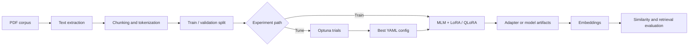

# Domain-Adaptive Masked Language Modeling

> An end-to-end Python pipeline for adapting encoder models to specialist corpora with masked language modeling (MLM), parameter-efficient fine-tuning, Optuna optimization, and quantitative embedding evaluation.

[](https://www.python.org/)
[](https://huggingface.co/docs/transformers/)
[](https://optuna.org/)
[](https://huggingface.co/docs/peft/)

This project turns a directory of PDF documents into a domain-adapted encoder. It covers document extraction, deterministic train/evaluation splitting, dynamic token masking, LoRA or QLoRA training, hyperparameter search, model persistence, and embedding generation. The repository is designed both as a practical training tool and as a transparent ML engineering case study.

## Why this project matters

General-purpose encoders often underrepresent specialist vocabulary and relationships. Continued MLM pretraining exposes an encoder to unlabeled domain text while preserving the original self-supervised objective. The resulting representation can improve retrieval, clustering, semantic search, and downstream supervised tasks—but improvement is measured, not assumed.



## Engineering highlights

| Capability | Implementation | Professional value |
|---|---|---|
| Document ingestion | Recursive PDF/PPTX extraction and overlap-aware chunking | Converts unstructured corpora into repeatable training inputs |
| Domain adaptation | Dynamic masked language modeling | Learns specialist language without labeled examples |
| Efficient tuning | LoRA; CUDA-aware 4-bit QLoRA fallback | Makes experimentation feasible on constrained hardware |
| Experiment selection | Optuna search over learning rate and weight decay | Replaces guesswork with validation-driven selection |
| Configuration | Versionable YAML plus CLI entry points | Separates experiment policy from application code |
| Evaluation | Validation loss, cosine similarity, class-separation metrics, PCA plots | Tests whether representation quality actually changes |
| Operational safeguards | CPU/CUDA selection, logging, checkpoints, model-path validation | Supports reproducible local and workstation runs |

## Repository map

```text
.
├── configs/mlm_training.yaml      # Reproducible experiment configuration
├── docs/                          # Technique notes and operating guides
├── notebooks/                     # Laptop-friendly, synthetic demonstrations
├── src/
│   ├── ingest.py                  # PDF/PPTX extraction and chunking
│   ├── mlm_trainer.py             # Dataset, PEFT training, persistence, embeddings
│   ├── hyperparams.py             # Optuna study and best-config generation
│   ├── sft_data.py                # Optional synthetic QA-data workflow
│   └── storage.py                 # Optional Google Cloud Storage helpers
├── run_mlm.py                     # Production-style training CLI
├── run_optuna.py                  # Hyperparameter-search CLI
└── tests/                         # Environment and component checks
```

## Quick start

```bash
git clone <your-repository-url>
cd mlm-training
uv sync

# Put one or more PDFs in data/books, then tune two core optimizer parameters.
uv run python run_optuna.py data/books configs/best.yaml \
  --model microsoft/deberta-v3-xsmall \
  --trials 8 \
  --config configs/mlm_training.yaml

# Train from the selected configuration.
uv run python run_mlm.py microsoft/deberta-v3-xsmall data/books \
  --config configs/best.yaml
```

[`microsoft/deberta-v3-xsmall`](https://huggingface.co/microsoft/deberta-v3-xsmall) is used in the tutorials because its backbone has 22M parameters, making it a more approachable DeBERTa-family baseline for laptop demonstrations. GPU acceleration is recommended for portfolio-scale experiments. The model is downloaded from Hugging Face on first use.

For CUDA, quantization, model download, configuration, and output details, see the [setup and run guide](docs/setup-and-run.md).

## Demonstrations

| Notebook | Question answered |
|---|---|
| [01_optuna_hyperparameter_search.ipynb](notebooks/01_optuna_hyperparameter_search.ipynb) | How are MLM hyperparameters selected from validation loss? |
| [02_animal_domain_mlm.ipynb](notebooks/02_animal_domain_mlm.ipynb) | Does animal-domain MLM improve held-out semantic separation over the original encoder? |

Both notebooks generate their animal corpus in memory, run on CPU, and expose `FAST_MODE` controls. The second notebook compares the untouched and adapted encoders using the same held-out sentence pairs, reports ROC AUC and positive/negative similarity margin, and visualizes similarity distributions and PCA projections. A small synthetic benchmark is a demonstration—not evidence of production generalization.

## Documentation

| Guide | Contents |
|---|---|
| [Setup and run](docs/setup-and-run.md) | Installation, data layout, tuning, training, and troubleshooting |
| [Data ingestion](docs/data-ingestion.md) | PDF extraction, chunking, leakage risks, and scalable extensions |
| [Masked language modeling](docs/masked-language-modeling.md) | Objective, dynamic masking, and continued pretraining |
| [LoRA and QLoRA](docs/lora-and-qlora.md) | Adapter math, quantization path, trade-offs, and improvements |
| [Optuna optimization](docs/optuna-hyperparameter-search.md) | Search space, objective, reproducibility, pruning, and storage |
| [Embedding evaluation](docs/embedding-evaluation.md) | Pooling, similarity metrics, baselines, and experiment design |
| [Synthetic data](docs/synthetic-data.md) | Animal demo generation and the optional Ollama QA pipeline |
| [Model lifecycle](docs/model-lifecycle.md) | Saving, loading, artifact lineage, and deployment extensions |
| [Cloud storage](docs/cloud-storage.md) | Optional GCS synchronization, environment safeguards, and MLOps extensions |

## Configuration

| Section | Examples |
|---|---|
| `paths` | Model, result, and log directories |
| `dataset` | Token length, chunk size/overlap, split, sample cap |
| `model` | Device, LoRA ranks, target modules, 4/8-bit loading |
| `training` | Epochs, batch size, optimizer values, accumulation, FP16 |

Optuna writes the winning values into `training` and adds an `optuna` provenance section. The output remains consumable by `run_mlm.py`.

## Evaluation philosophy

Domain adaptation can lower MLM loss while degrading a downstream representation. A credible experiment therefore compares against the unchanged base encoder on a frozen test set and reports uncertainty across multiple seeds. The included notebooks establish this pattern; a production study should add retrieval metrics such as Recall@k and nDCG, multiple corpora, stronger embedding baselines, and confidence intervals.

## Current limitations and roadmap

- PDF reading is text-first and does not yet include OCR or layout reconstruction.
- Optuna currently tunes learning rate and weight decay; batch size, masking rate, adapter rank, schedulers, and pruning are natural extensions.
- The training split is chunk-level; document-level splitting should be used to prevent near-duplicate leakage in formal evaluations.
- MLM-adapted hidden states are not guaranteed to be optimal sentence embeddings. Contrastive post-training is a valuable second stage.
- Experiment tracking and artifact manifests can be strengthened with MLflow, Weights & Biases, or an internal registry.

## Responsible use

Only train on documents you are authorized to process. Inspect extracted text for personal or confidential information, record model/data licenses, and evaluate domain bias before deployment. Quantitative gains on synthetic data should never be presented as real-world performance.

## License

Add the license appropriate for your intended portfolio and reuse terms before publishing.
