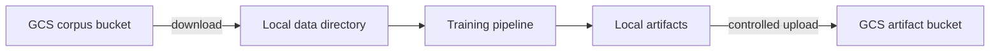

# Cloud Storage and Data Portability

`src/storage.py` provides optional Google Cloud Storage (GCS) helpers for listing, downloading, and uploading blobs and directory trees. It also checks an environment mode before selected upload operations, reducing the chance of development artifacts being pushed unintentionally.

## Operational concerns

| Concern | Recommended control |
|---|---|
| Credentials | Application Default Credentials or workload identity; never committed keys |
| Access | Separate read-only corpus and artifact-writer service accounts |
| Reproducibility | Immutable object versions and corpus manifests |
| Integrity | Content hashes before and after transfer |
| Privacy | Encryption, retention policies, regional controls, and audit logs |
| Cost | Lifecycle rules for old checkpoints and incomplete uploads |

## Extensions and improvements

- Replace string environment checks with explicit configuration and least-privilege IAM.
- Stream or cache large objects rather than downloading an entire corpus eagerly.
- Add resumable transfers, retry/backoff, checksums, and structured error reporting.
- Store artifact manifests and metrics alongside models using immutable run IDs.
- Support versioned datasets so an experiment always resolves the same object generation.
- Abstract the backend to support S3-compatible stores and Azure Blob Storage.
- Add integration tests against an emulator or isolated test bucket.
