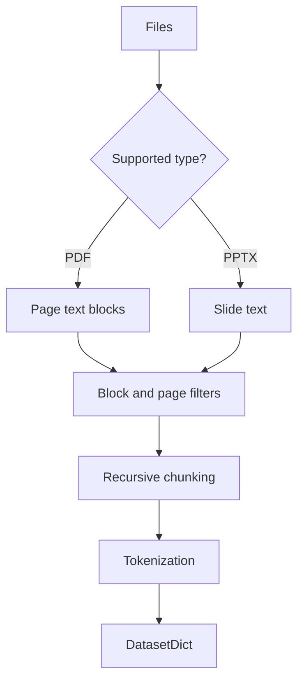

# Data Ingestion and Chunking

`src/ingest.py` recursively discovers documents, extracts PDF text with PyMuPDF (and PPTX text with `python-pptx`), filters obvious page artifacts, and uses a recursive text splitter to create overlapping samples.

## Key design choices

| Choice | Benefit | Risk |
|---|---|---|
| Recursive discovery | Simple corpus assembly | Accidental inclusion of private or test files |
| Character-based chunks | Model-independent preprocessing | Token lengths vary by language and vocabulary |
| Overlap | Preserves boundary context | Creates near-duplicates and possible split leakage |
| Header/footer filtering | Reduces repetitive noise | Rule-based filters can remove valid content |

Chunk size should be large enough to preserve useful context but short enough to fit the tokenizer limit after tokenization. Overlap is useful for training, but the train/test assignment should happen at document level before chunking in rigorous experiments.

## Extensions and improvements

- Add MIME detection and a strict allow-list instead of relying only on extensions.
- Add OCR with confidence scores for scanned documents.
- Preserve document ID, page, section, and extraction version as dataset columns.
- Hash documents and chunks for deduplication and corpus manifests.
- Use token-aware chunking and sentence boundaries.
- Add layout-aware parsing for tables, captions, columns, and reading order.
- Split documents before chunking, then measure duplicate rates across splits.
- Cache extracted text in Parquet or Arrow to avoid repeated PDF parsing.
- Add PII detection, redaction, licensing metadata, and data-retention controls.
