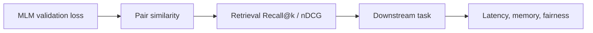

# Embedding Generation and Evaluation

The embedding path loads an encoder, obtains last-layer hidden states, and pools token representations using mean, CLS, or max pooling. Optional L2 normalization makes dot product equivalent to cosine similarity.

## Pooling strategies

| Strategy | Calculation | Consideration |
|---|---|---|
| Mean | Attention-mask-aware token average | Strong simple baseline; includes all valid tokens |
| CLS | First token state | Not necessarily trained as a sentence representation |
| Max | Per-dimension maximum | Sensitive to extreme activations |

## Evaluation ladder

The animal notebook uses matched and unmatched sentence pairs. It reports ROC AUC and the separation margin between average positive and negative cosine similarity. These are more informative than a hand-picked nearest-neighbor example, but still limited by the synthetic benchmark.

## Fair comparison checklist

- Freeze evaluation texts before training and Optuna selection.
- Use identical tokenization length, pooling, normalization, and device.
- Compare to both the original encoder and a strong sentence-embedding baseline.
- Report repeated seeds and bootstrap confidence intervals.
- Prevent paraphrases or overlapping chunks from entering both training and evaluation.
- Inspect failure cases rather than only aggregate scores.

## Extensions and improvements

- Add retrieval corpora with relevance judgments and report Recall@k, MRR, and nDCG.
- Evaluate anisotropy and whitening before attributing gains to semantic structure.
- Add UMAP only as an exploratory visualization; never use it as the sole metric.
- Evaluate cross-domain retention to quantify catastrophic forgetting.
- Add contrastive fine-tuning after MLM and ablate the contribution of each stage.
- Track inference throughput, batch latency, index size, and energy alongside quality.
