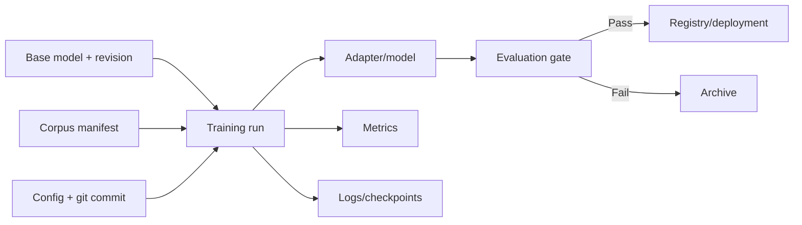

# Model and Artifact Lifecycle

The project can download base models, save full models or PEFT adapters, reload artifacts, and generate embeddings. A professional lifecycle also needs lineage: which data, code, model revision, and configuration produced each artifact.

## Recommended artifact manifest

| Field | Reason |
|---|---|
| Base model ID and immutable revision | Reconstruct adapter dependencies |
| Corpus hashes and preprocessing version | Establish data lineage |
| Full YAML and CLI invocation | Reproduce training policy |
| Git commit and environment lock hash | Reproduce implementation |
| Seeds and hardware | Interpret variance and numerical differences |
| Base/adapted evaluation results | Prevent unmeasured promotion |
| License and intended use | Support governance |

## Extensions and improvements

- Write a JSON manifest beside every saved adapter.
- Use safetensors consistently and verify artifact hashes after upload.
- Add an experiment tracker and model registry with promotion stages.
- Pin Hugging Face revisions instead of relying on mutable model IDs.
- Add smoke tests that load each artifact and produce finite embeddings.
- Export ONNX/OpenVINO variants and benchmark numerical similarity.
- Add retention policies for checkpoints and avoid committing large binaries or sensitive logs.
