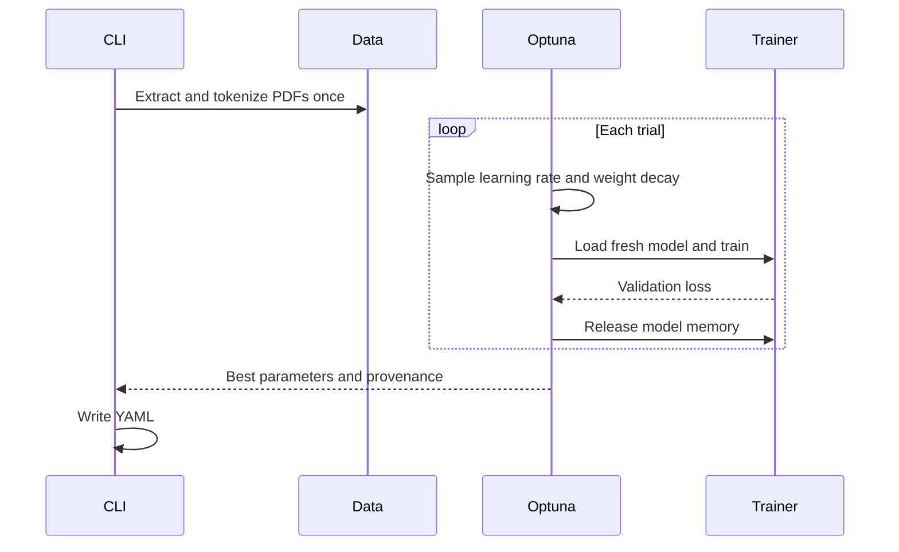

# Optuna Hyperparameter Search

`src/hyperparams.py` prepares the dataset once, creates a fresh model per trial, samples optimizer parameters, trains, evaluates validation loss, and releases model/GPU memory. `run_optuna.py` writes the winning values into a complete YAML training configuration.

## Current search space

| Parameter | Distribution | Range |
|---|---|---:|
| Learning rate | Log-uniform | `1e-5` to `2e-4` |
| Weight decay | Log-uniform | `1e-3` to `1e-1` |

Log sampling is appropriate because useful optimizer values often vary by orders of magnitude. All other settings come from the base YAML and remain fixed.

## Experimental cautions

The validation split used for search is no longer an unbiased final test set. Maintain a third, document-level test set for final reporting. Search comparisons also require controlled seeds, equal budgets, and identical data.

## Extensions and improvements

- Use SQLite/PostgreSQL storage so studies resume after interruption.
- Add median/Hyperband pruning and report intermediate evaluation loss.
- Search masking probability, effective batch size, warmup ratio, LoRA rank/dropout, and scheduler.
- Make the search conditional: quantization parameters only when QLoRA is enabled.
- Add OOM-aware failed-trial handling without hiding unrelated exceptions.
- Optimize a downstream metric or a multi-objective frontier of quality, latency, and memory.
- Export trial tables, parameter importances, parallel-coordinate plots, and study seeds.
