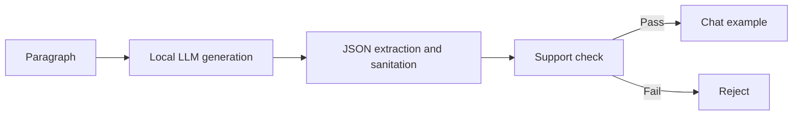

# Synthetic Data

Synthetic examples serve two distinct purposes in this repository: deterministic animal-domain notebook demonstrations and optional LLM-generated QA data in `src/sft_data.py`.

## Animal demonstration

The notebooks create short facts from explicit species, habitat, diet, class, and behavior templates. This makes the experiment portable and inspectable while avoiding an external dataset download. Held-out evaluation sentences use separate wording.

| Strength | Limitation |
|---|---|
| Reproducible and license-simple | Narrow vocabulary and templated syntax |
| Fast enough for tutorial runs | Easier than real document noise |
| Ground-truth relationships are explicit | May reward template artifacts |

## Optional QA generation

`src/sft_data.py` extracts PDF text, normalizes and splits paragraphs, asks a local Ollama model to generate question-answer pairs, sanitizes JSON, and can perform a second support check before emitting chat examples.

## Extensions and improvements

- Separate generator, verifier, and target model families to reduce correlated errors.
- Store source spans and require answer entailment from those spans.
- Measure duplication, lexical diversity, label balance, and template leakage.
- Add schema validation with typed models instead of permissive JSON repair alone.
- Human-review a statistically meaningful sample and publish acceptance criteria.
- Mix synthetic and authentic examples and run an ablation against authentic-only data.
- Track prompts, generator version, decoding parameters, and rejection reasons.
